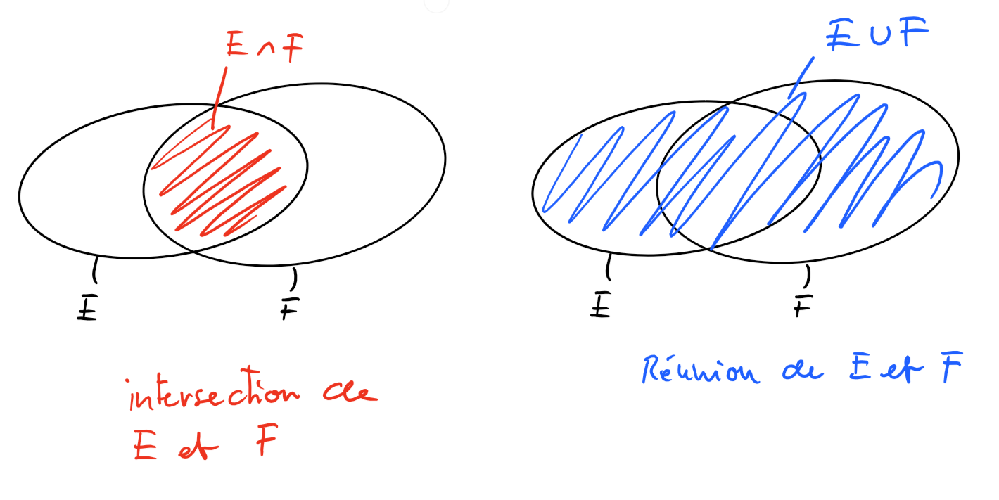

Axiomes et propriétés du calcul des probabilités
=====================

Le calcul des probabilités est fondé sur les axiomes (principes) suivants

Axiomes
-------

Tout le calcul des probabilités découle des trois axiomes ci-dessous

..  admonition:: Axiome 1
    :class: tip

    La probabilité d'un événement :math:`E` est un nombre réel compris entre 0 et 1 :

    ..  math::

        0 \leq P(E) \leq 1

..  admonition:: Axiome 2
    :class: tip

    La probabilité de l'événement certain :math:`E = \Omega` est égale à 1 :

    ..  math::

        P(\Omega) = 1

..  admonition:: Axiome 3
    :class: tip

    La probabilité de la réunion de deux événements **incompatibles** est égale à la somme de leur probabilité :

    ..  math::

        \text{Si } E \cap F = \emptyset,
        \text{alors }
        P(E \cup F) = P(E) + P(F)

Théorèmes
---------

..  admonition:: Théorème 1
    :class: warning

    Lorsqu'on calcule la probabilité de la réunion de deux événements, on ne peut additionner les probabilités que si les événements sont incompatibles (voir axiome 3). Par contre, si l'intersection des événements n'est pas vide (s'ils possèdent des issues en commun), il faut éviter de les compter deux fois et l'on a 

    ..  math::

        P(E \cup F) = P(E) + P(F) - P(E \cap F)

Illustration
++++++++++++

Exemples 
++++++++

Soient les événements 

*   :math:`E =` "Avoir une somme paire"
*   :math:`F =` "Avoir une somme supérieure à 10"
*   :math:`E \cup F =` "Avoir une somme supérieure à 10 **ou** une somme paire"
*   :math:`E \cup F =` "Avoir une somme supérieure à 10 **et** une somme paire"

..  admonition:: Théorème 2
    :class: warning

    Si l'on connait la probabilité d'un événement :math:`E`, on peut calculer la probabilité de l'événement contraire :math:`\overline{E}` de la manière suivante : 

    ..  math::

        P(\overline{E}) = 1 - P(E)

..  admonition:: Théorème 3
    :class: warning

    La probabilité de l'événement impossible est nulle

    ..  math::

        P(\emptyset) = 0
    

..  admonition:: Théorème 4
    :class: warning

    Soient :math:`E_1, E_2, \ldots, E_n` des **événements incompatbles**, alors la
    probabilité de leur réunion est la somme de leur probabilité :

    ..  math::

        P(E_1 \cup E_2 \cup \ldots \cup E_n) =
        P(E_1) + P(E_2) + \ldots + P(E_n)

..  admonition:: Théorème 5
    :class: warning

    Soient :math:`E, F \subset \Omega` deux événements. 

    ..  math::

        P(F \cap \overline{E}) = P(F) - P(F \cap E)

