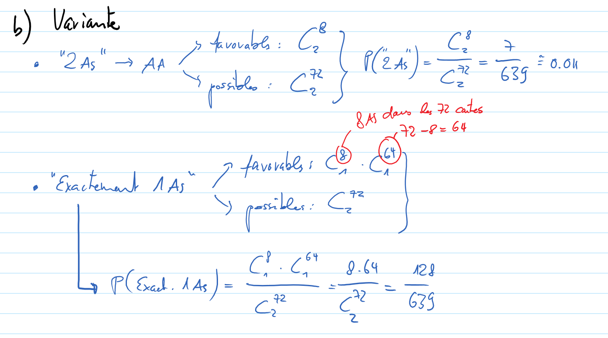

Exercice 12
===========

Comme dans le b), on peut considérer que le tirage est simultané. Il est
possible de le faire comme l'exercice 9 ou 11 :

..  comment::

    Variante pour le b)
    -------------------

    ..  figure:: figures/exo-12.png
        :align: center
        :width: 95%
