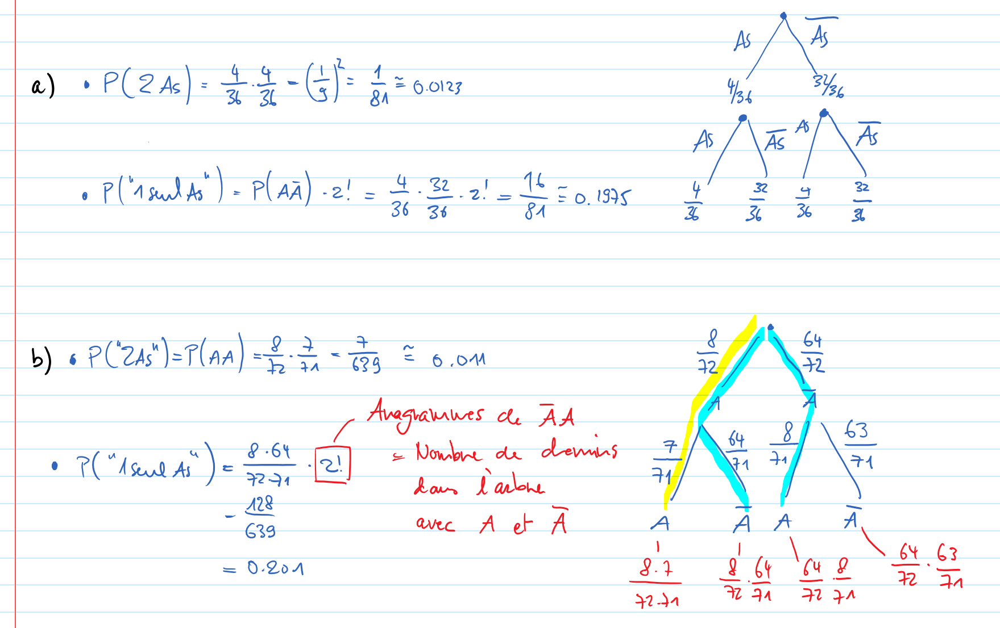

Exercice 12
===========

Variante pour le b)
-------------------

Comme dans le b), on peut considérer que le tirage est simultané, il est
également possible de le faire comme l'exercice 9 ou 11 :

