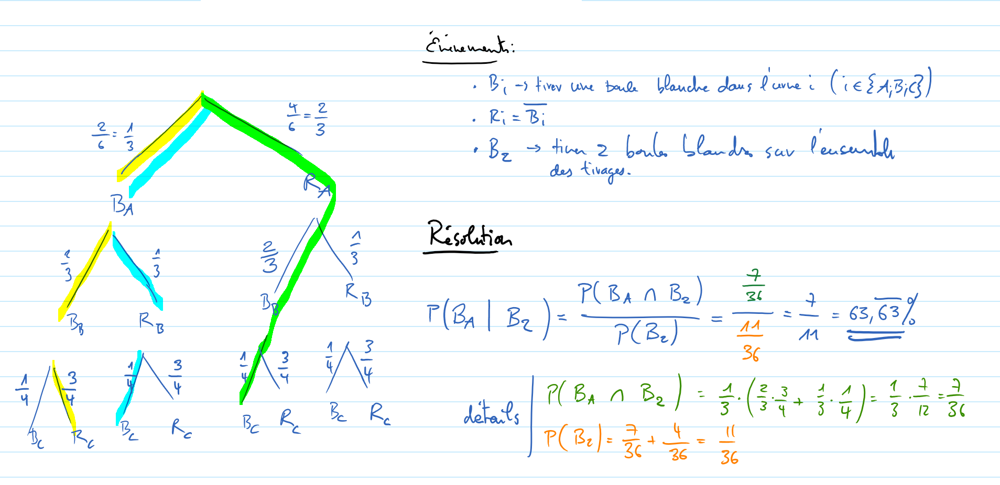

Exercice 23
===========

..  admonition:: Définition des événements

    Soient les événements suivants

    *   :math:`B_i` => "Tirer une boule blanche dans l'urne :math:`i`"

        *   Exemple : :math:`B_A` => "Tirer une boule blanche dans l'urne :math:`A`"

    *   :math:`R_i = \overline{B_i}` => "Tirer une boule rouge dans l'urne :math:`i`"
    
    *   :math:`B_2` => "Tirer exactement deux boules sur l'ensemble du tirage"

Résolution
----------

