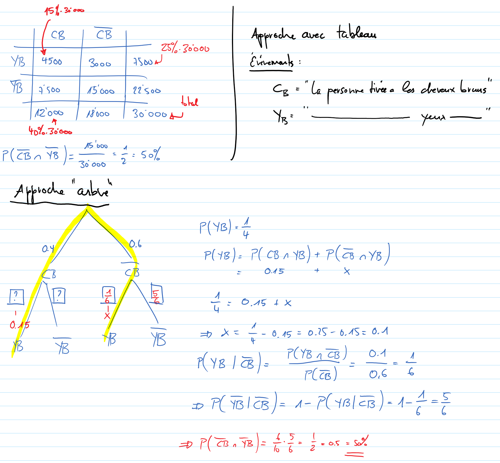

Exercice 25
===========

..  admonition:: Définition des événements

    Soient les événements suivants

    *   YB => "La personnes choisie a les yeux bruns"
    *   CB => "La personnes choisie a les cheveux bruns"
    

Résolution
----------

