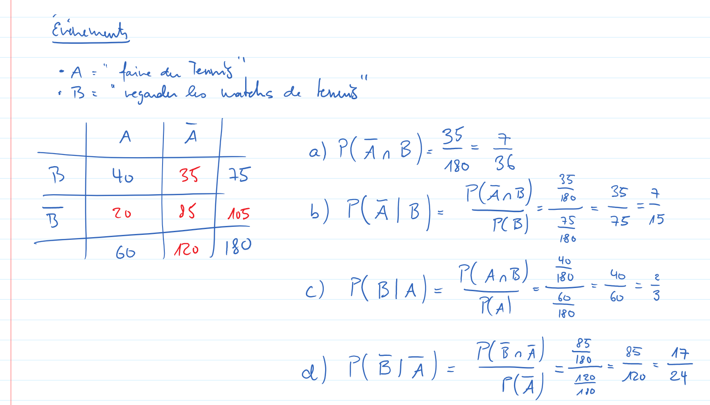

Exercice 27
===========

..  admonition:: Définition des événements

    Soient les événements suivants

    *   A => "La personnes choisie fait du tennis"
    *   B => "La personnes choisie regarde les matchs de tennis"
    

Résolution
----------

