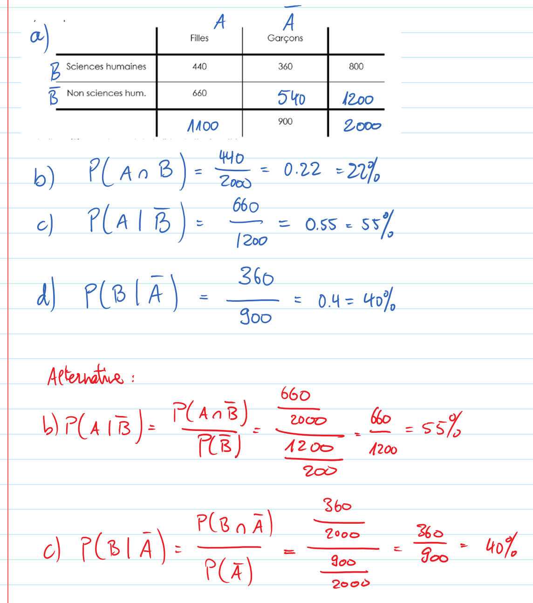

Exercice 28
===========

..  admonition:: Définition des événements

    Soient les événements suivants

    *   A => "La personnes choisie est une fille"
    *   B => "La personnes choisie étudie les sciences humaines"
    

Résolution
----------

