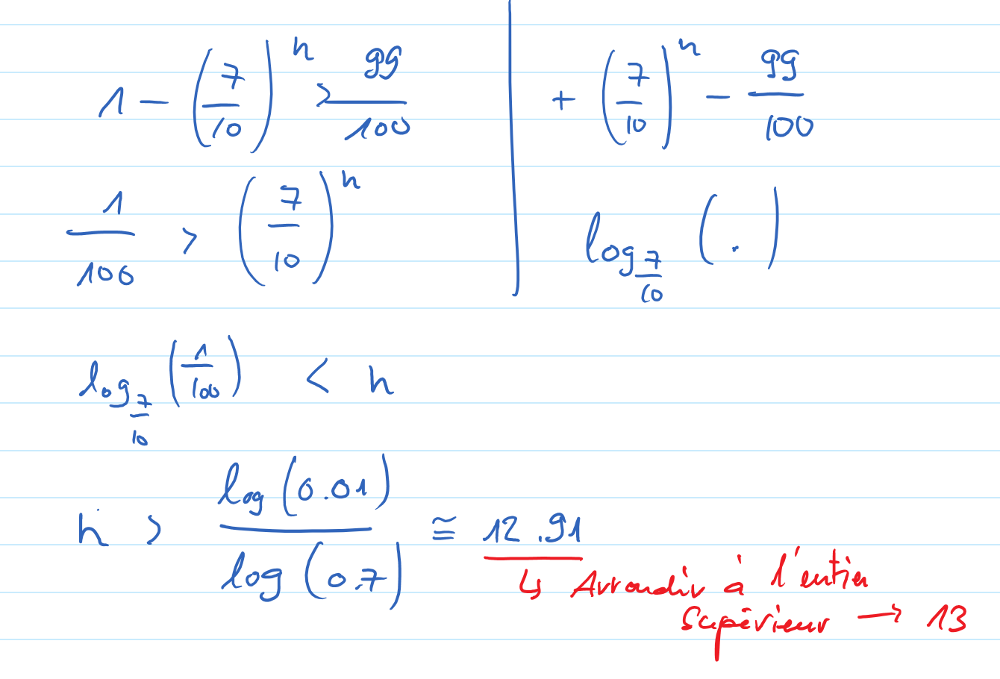

Exercice 30
===========

Résolution détaillée
--------------------

Puisque Richard effectue plusieurs fois la même épreuve aléatoire (tirer sur la
cible) et que ces épreuves sont indépendantes (du moins on le suppose ici car il
s'agit d'une hypothèse assez raisonnable), l'utilisation de la binomiale est
indiquée puisque l'on veut travailler avec la probabilité que cette épreuve
réuisse un certain nombre de fois. 

..  admonition:: Définition des événements
    :class: warning

    *   :math:`C = \text{"Richard touche la cible lors d'un lancer"}` 
    *   :math:`C_1 = \text{"Richard touche la cible au moins une fois sur les } n \text{ lancers"}` 
    *   :math:`E = \overline{C_1} = \text{"Richard touche la cible 0 fois sur les } n \text{ lancers"}` 

On a donc les probabilités 
:math:`p = P(C) = \frac{3}{10} = 0.3` et 
:math:`q = P(\overline{C}) = 1 - \frac{3}{10} = 1 - 0.3 = 0.7`

La probabilité que Richard touche la cible au moins une fois sur les :math:`n`
lancers vaut donc, en utilisant la loi binômiale avec :math:`k = 0`, :math:`p = P(C) = 0.3` et :math:`q = 1 - p = 1 - P(C)` = 0.7 :

..  math::

    P(C_1) = 1 - P(E) = 1 - C_k^n \cdot p^k \cdot q^{(n-k)} = 1 - C_0^n \cdot 0.3^0 \cdot 0.7^{n} = 1 - 0.7^n

puisque :math:`C_0^n = 1` quel que soit :math:`n \in \mathbb{N}` et :math:`0.3^0 = 1`.

On veut trouver :math:`n \in \mathbb{N}` pour que :math:`P(C_1) > \frac{99}{100}
= 0.99`. On doit donc résoudre l'inéquation

..  admonition:: Réponse finale
    :class: tip 
    
    Richard doit tirer au moins 13 fois pour avoir plus de 99 chances sur 100 de
    touche la cible au moins une fois.