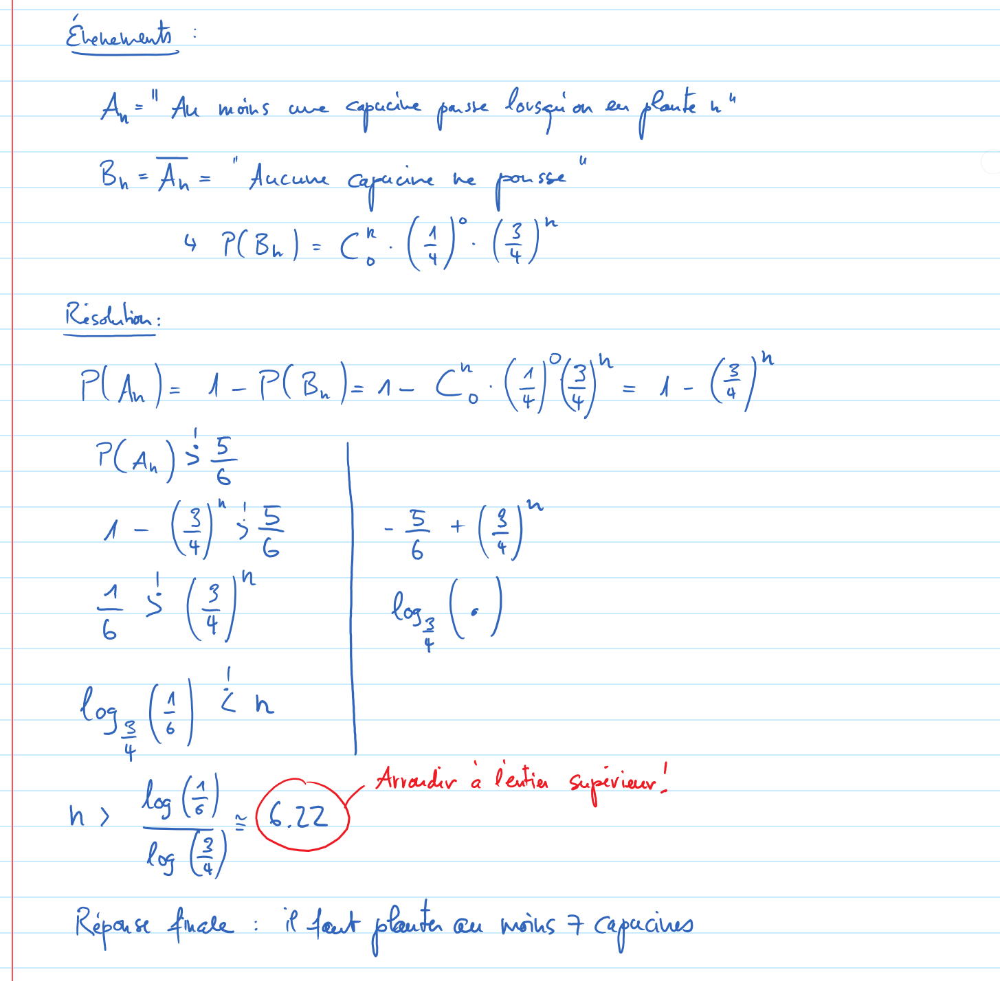

Exercice 31
===========

Événements
----------

*   :math:`A_n =` "Avoir au moins une capucine qui pousse lorsqu'on en plante :math:`n`.
*   :math:`B_n = \overline{A_n} =` "Aucune capucine ne pousse sur les :math:`n` qui ont été plantées.

Résolution
----------

