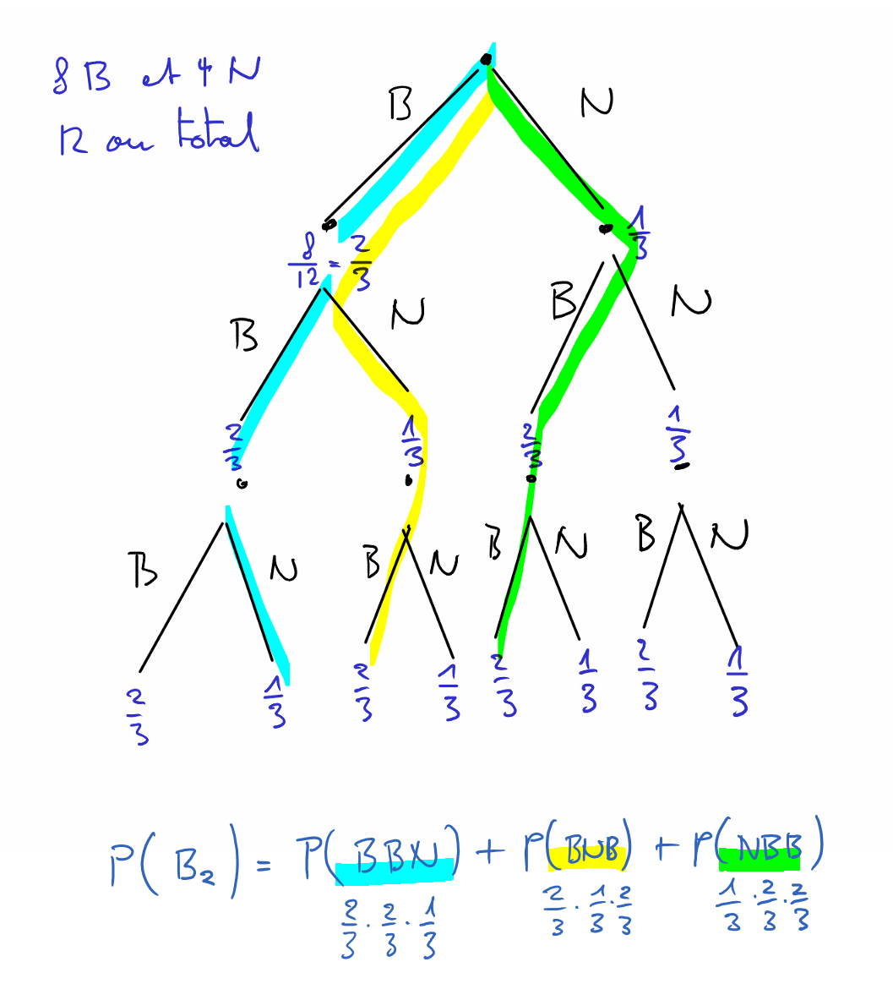

Loi binomiale
=============

Exemple d'introduction
----------------------

..  admonition:: Question

    Dans une urne, on a 8 boules blanches et 4 boules noires. On répète trois
    fois l'expérience consistant à tirer une boule avec remise.

    Déterminer la probabilité de tirer exactement deux boules blanches sur
    l'ensemble des trois tirages.

Solution
++++++++

Pour résoudre ce problème, on peut dessiner un arbre pour représenter ces trois
tirages. Les chemins mis en évidence sont ceux qui mènent à l'événement :math:`B_2 =` "tirer deux boules blanches sur l'ensemble du tirage".

La probabilité de tirer deux boules blanches parmi les trois est donnée par tous les chemins qui comprennent deux B et 1 N. Cette probabilité vaut donc  

..  math:: 

    P(B_2) &= P(BBN) + P(BNB) + P(NBB) \\

    &=
    \frac{2}{3}
    \cdot
    \frac{2}{3}
    \cdot
    \frac{1}{3}
    +
    \frac{2}{3}
    \cdot
    \frac{1}{3}
    \cdot
    \frac{2}{3}
    +
    \frac{1}{3}
    \cdot
    \frac{2}{3}
    \cdot
    \frac{2}{3}

On constate que chacun des trois chemins possibles a exactement la même probabilité

..  math:: 

    \frac{2}{3}
    \cdot
    \frac{2}{3}
    \cdot
    \frac{1}{3}
    =
    \left(\frac{2}{3} \right)^2
    \cdot
    \left(
    \frac{1}{3}
    \right)^1
    =
    \left(\frac{2}{3} \right)^k
    \cdot
    \left(
    \frac{1}{3}
    \right)^{n-k}

Sachant qu'il y a :math:`C^3_2 = \frac{3!}{2! \cdot 1!} = 3` chemins possibles dans l'arbre qui contiennent
:math:`2` boules blanches, on peut calculer la probabilité de l'ensemble des
chemins avec

..  math::

    P(B_2)
    &=
    C^{3}_{2}
    \cdot 
    \left(\frac{2}{3} \right)^2
    \cdot
    \left(
    \frac{1}{3}
    \right)^1
    &=
    3
    \cdot 
    \left(\frac{2}{3} \right)^2
    \cdot
    \left(
    \frac{1}{3}
    \right)^1
    &=
    0.\overline{4}
    \approx
    44.4 \%

..  admonition:: Loi binomiale
    :class: warning

    De manière générale, considérons une épreuve aléatoire comportant deux issues
    possibles : succès (S) / échec (E) dont on connait les probabilités :

    *   :math:`P(S) = p`
    *   :math:`P(E) = q = 1 - p`

    et soit :math:`A` l'événement "obtenir :math:`k` succès sur :math:`n` répétitions de l'épreuve".

    On peut déterminer la probabilité qu'en répétant l'épreuve :math:`n` fois de suite, on obtienne :math:`k` succès avec la loi binomiale :
    
    ..  math::

        P(A) =
        C^n_k \cdot p^k \cdot q^{n-k} = 
        C^n_k \cdot p^k \cdot (1-p)^{n-k}

..  admonition:: Exemple 1
    :class: tip

    On lance un dé équilibré 20 fois de suite. Quelle probabilité a-t-on
    d'obtenir 4 fois un "6" ? La probabilité de l'issue "succès = obtenir 6"
    vaut donc :math:`p = \frac{1}{6}` et la probabilité de l'échec = "obtenir autre chose que le 6" vaut :math:`q = 1 - p = \frac{5}{6}`.

    ..  math::

        P(\text{"Obtenir 4 fois un 6"})
        =
        C^{20}_4 \cdot
        \left(
        \frac{1}{6}
        \right)
        ^{4}
        \cdot
        \left(
        \frac{5}{6}
        \right)
        ^{16}
        \approx
        0.202
        = 20.2 \%

