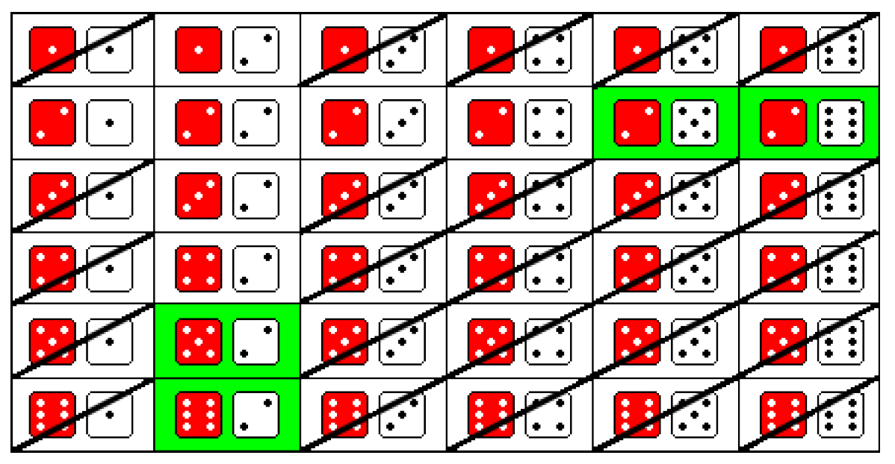

Probabilités conditionnelles
============================

Exemple d'introduction
----------------------

..  admonition:: Question

    On jète deux dés simultanément. Quelle est la probabilité d'obtenir une somme supérieure à 6 sachant que l'un des deux dés indique 2 ?

..  admonition:: Univers de l'expérience

    ..  math:: 

        \Omega = \{
            (1 ; 1) ; (2 ; 1) ; (3 ; 1) ; (4 ; 1) ; (5 ; 1) ; (6 ; 1) \\
            (1 ; 2) ; (2 ; 2) ; (3 ; 2) ; (4 ; 2) ; (5 ; 2) ; (6 ; 2) \\
            (1 ; 3) ; (2 ; 3) ; (3 ; 3) ; (4 ; 3) ; (5 ; 3) ; (6 ; 3) \\
            (1 ; 4) ; (2 ; 4) ; (3 ; 4) ; (4 ; 4) ; (5 ; 4) ; (6 ; 4) \\
            (1 ; 5) ; (2 ; 5) ; (3 ; 5) ; (4 ; 5) ; (5 ; 5) ; (6 ; 5) \\
            (1 ; 6) ; (2 ; 6) ; (3 ; 6) ; (4 ; 6) ; (5 ; 6) ; (6 ; 6)
        \}
        

..  admonition:: Événements

    *   :math:`E =` "La somme des dés est supérieure à 6"
    *   :math:`F =` "Un des deux dés indique un 2"

Résolution sans les probabilités conditionnelles
------------------------------------------------

Voici une représentation visuelle des 36 issues. 

Comme on sait que l'un des deux dés au moins indique un 2, beaucoup d'issues ne
sont pas envisageables en tant que "cas possibles". De ce fait, les issues qui
ne sont pas envisageables sont biffées et les issues favorables sont en vert. Il
y a donc 11 issues possibles (celles qui ne sont pas biffées) et 4 issues
favorables. Cela nous donne donc le résultat suivant pour la probabilité d'avoir une somme supérieure à 6 sachant que l'un des deux dés indique un 2, noté :math:`P(E | F)` :

..  math::

    P(E | F) 
    = \cfrac{\text{issues favorables}}{\text{issues possibles}}
    = \cfrac{4}{11}
    \approx 36.36 \%

Définition des probabilités conditionnelles
-------------------------------------------

..  admonition:: Définition (probabilité conditionnelle)
    :class: tip

    Soient :math:`E` et :math:`F` deux événements d'un univers :math:`\Omega`. Si :math:`P(F) \neq 0`, on appelle probabilité conditionnelle de :math:`E` par :math:`F` ou ":math:`E` étant donné :math:`F`" le nombre noté :math:`P(E | F)` et tel que

    ..  math::

        P(E | F)
        =
        \cfrac{
            P(E \cap F)
        }{
            P(F)
        }

Résolution avec la Définition
-----------------------------

On peut donc également calculer la probabilité d'avoir une somme supérieure à 6
sachant que l'un des deux dés indique un 2 de la manière suivante :

..  admonition:: Événements

    *   :math:`E =` "La somme des dés est supérieure à 6"
    *   :math:`F =` "Un des deux dés indique un 2"
    *   :math:`E \cap F =` "La somme des dés est supérieure à 6 et l'un des deux dés indique un 2"

..  only:: html
    
    ..  figure:: figures/des-probas-cond-intro.png
        :align: center
        :width: 100%

D'après la liste des issues, on voit que

*   :math:`P(E \cap F) = \cfrac{4}{36}`
*   :math:`P(F) = \cfrac{11}{36}`

De ce fait, 

    ..  math::

        P(E | F)
        =
        \cfrac{
            P(E \cap F)
        }{
            P(F)
        }
        =
        \cfrac{
            \cfrac{4}{36}
        }{
            \cfrac{11}{36}
        }
        =
        \cfrac{4}{36}
        \cdot 
        \cfrac{36}{11}
        =
        \cfrac{4}{11}

